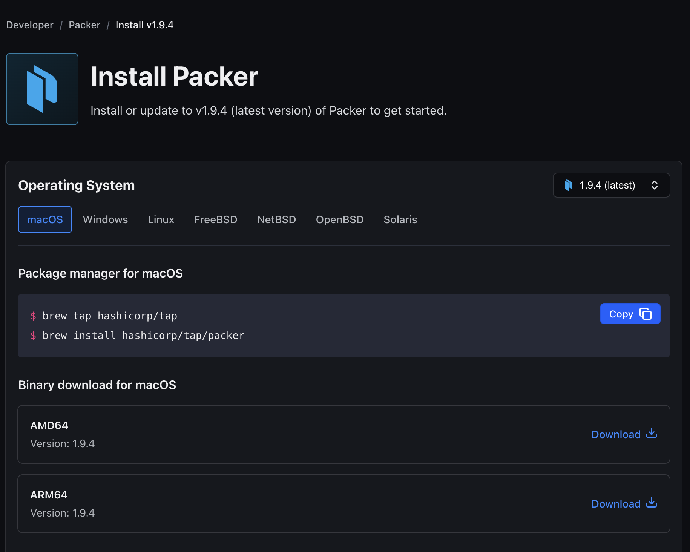
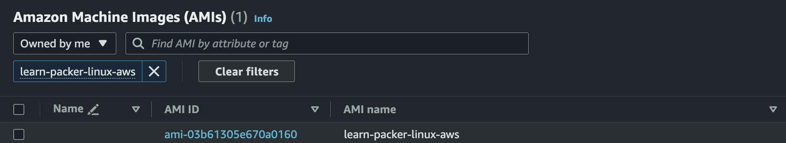
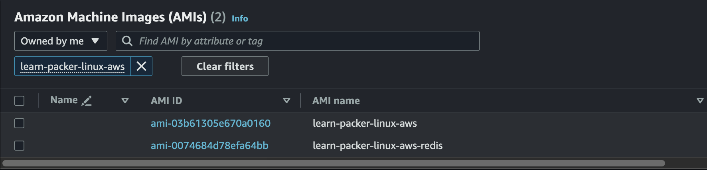
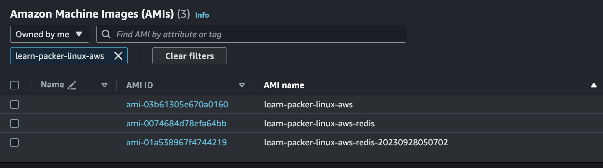
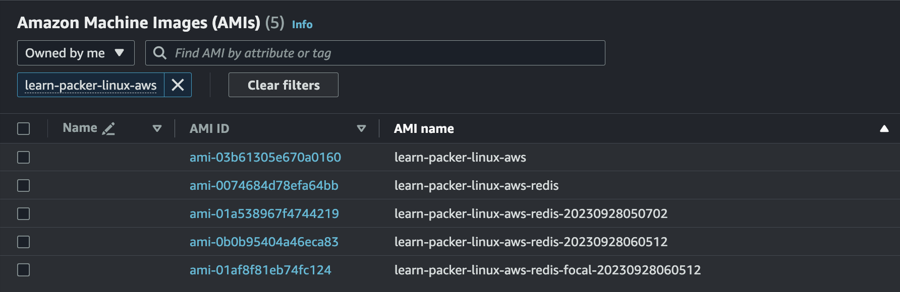

# Quick_Start_AWS01
Ref : https://developer.hashicorp.com/packer/tutorials/aws-get-started

## A. Install Packer
- Packer Download  
    <br>
    Ref : https://developer.hashicorp.com/packer/downloads

- MAC Example
    ```bash
    $ wget https://releases.hashicorp.com/packer/1.9.4/packer_1.9.4_darwin_arm64.zip
    $ unzip packer_1.9.4_darwin_arm64.zip 
    $ mv ./packer /usr/local/bin/packer 
    ```

- Verify Packer Installation
    ```bash
    $ packer --version
    1.9.4
    ```
    Ref : https://developer.hashicorp.com/packer/tutorials/aws-get-started/get-started-install-cli


## B. Build an Image
- File Structure
  ```bash
  $ mkdir packer_tutorial
  $ touch packer_tutorial/aws-ubuntu.pkr.hcl
  $ cd packer_tutorial
  tree
    .
    └── packer_tutorial
        ├── README.md
        └── aws-ubuntu.pkr.hcl
  ```
- aws-ubuntu.pkr.hcl
    ```hcl
    packer {
        required_plugins {
            amazon = {
                version = ">= 1.2.6"
                source  = "github.com/hashicorp/amazon"
            }
        }
    }

    source "amazon-ebs" "ubuntu" {
        ami_name      = "learn-packer-linux-aws"
        instance_type = "t2.micro"
        region        = "ap-northeast-2"
        source_ami_filter {
            filters = {
                name                = "ubuntu/images/*ubuntu-xenial-16.04-amd64-server-*"
                root-device-type    = "ebs"
                virtualization-type = "hvm"
            }
            most_recent = true
            owners      = ["099720109477"]
        }
        ssh_username = "ubuntu"
    }

    build {
        name    = "learn-packer"
        sources = [
            "source.amazon-ebs.ubuntu"
        ]
    } 
    ```


### Create Image
***1. Initialize Packer configuration***
```bash
$ packer init .  
Installed plugin github.com/hashicorp/amazon v1.2.7 in "/Users/{User}/.config/packer/plugins/github.com/hashicorp/amazon/packer-plugin-amazon_v1.2.7_x5.0_darwin_arm64"
```

***2. Format and validate your Packer template***
```bash
$ pakcer fmt .

$ packer validate aws-ubuntu.pkr.hcl
The configuration is valid.
```

***3. Build Packer image***
```bash
$ packer build aws-ubuntu.pkr.hcl
learn-packer.amazon-ebs.ubuntu: output will be in this color.

==> learn-packer.amazon-ebs.ubuntu: Prevalidating any provided VPC information
==> learn-packer.amazon-ebs.ubuntu: Prevalidating AMI Name: learn-packer-linux-aws
    learn-packer.amazon-ebs.ubuntu: Found Image ID: ami-0dd97ebb907cf9366
...
==> learn-packer.amazon-ebs.ubuntu: Creating AMI learn-packer-linux-aws from instance i-0c0ea1908ca06236f
    learn-packer.amazon-ebs.ubuntu: AMI: ami-03b61305e670a0160
...
Build 'learn-packer.amazon-ebs.ubuntu' finished after 3 minutes 15 seconds.

==> Wait completed after 3 minutes 15 seconds

==> Builds finished. The artifacts of successful builds are:
--> learn-packer.amazon-ebs.ubuntu: AMIs were created:
ap-northeast-2: ami-03b61305e670a0160
```
<br>


## C. Provision
- AMI 이름은 고유해야 하므로 `source block` 에 ami_name 속성 변경
    - `ami_name = "learn-packer-linux-aws”` → `ami_name = "learn-packer-linux-aws-redis”`
        ```hcl
        #### 변경 전
        source "amazon-ebs" "ubuntu" {
            ami_name      = "learn-packer-linux-aws"
            ...
        }

        #### 변경 후
        source "amazon-ebs" "ubuntu" {
            ami_name      = "learn-packer-linux-aws-redis"
            ...
        }
        ```

- aws-ubuntu.pkr.hcl 파일에 provisioner block 추가
  
  ```hcl
  build {
    name    = "learn-packer"
    sources = [
        "source.amazon-ebs.ubuntu"
    ]

    provisioner "shell" {
        environment_vars = [
            "FOO=hello world",
        ]
        inline = [
            "echo Installing Redis",
            "sleep 30",
            "sudo apt-get update",
            "sudo apt-get install -y ec2-instance-connect",
            "sudo apt-get install -y redis-server",
            "echo \"FOO is $FOO\" > example.txt",
        ]
    }
        provisioner "shell" {
            inline = ["echo This provisioner runs last"]
        }
    }
    ```

- Build Packer image
  
    ```
    learn-packer.amazon-ebs.ubuntu: output will be in this color.

    ==> learn-packer.amazon-ebs.ubuntu: Prevalidating any provided VPC information
    ==> learn-packer.amazon-ebs.ubuntu: Prevalidating AMI Name: learn-packer-linux-aws-redis
        learn-packer.amazon-ebs.ubuntu: Found Image ID: ami-0dd97ebb907cf9366
    ...
        learn-packer.amazon-ebs.ubuntu: Installing Redis
    ...
        learn-packer.amazon-ebs.ubuntu: This provisioner runs last
    ...
    ==> learn-packer.amazon-ebs.ubuntu: Creating AMI learn-packer-linux-aws-redis from instance i-0d2ad9b3ecab3f291
        learn-packer.amazon-ebs.ubuntu: AMI: ami-0074684d78efa64bb
    ...

    ==> Wait completed after 4 minutes 5 seconds

    ==> Builds finished. The artifacts of successful builds are:
    --> learn-packer.amazon-ebs.ubuntu: AMIs were created:
    ap-northeast-2: ami-0074684d78efa64bb
    ```
    <br>


## D. Variables
- aws-ubuntu.pkr.hcl
  - `variable block`, `locals block` 추가
  - `ami_name` 변경
        ```hcl
        variable "ami_prefix" {
            type    = string
            default = "learn-packer-linux-aws-redis"
        }

        locals {
            timestamp = regex_replace(timestamp(), "[- TZ:]", "")
        }


        source "amazon-ebs" "ubuntu" {
            ami_name      = "${var.ami_prefix}-${local.timestamp}"
            ...
        }
        ```
  - Build Packer Image
    ```
    learn-packer.amazon-ebs.ubuntu: output will be in this color.

    ==> learn-packer.amazon-ebs.ubuntu: Prevalidating any provided VPC information
    ==> learn-packer.amazon-ebs.ubuntu: Prevalidating AMI Name: learn-packer-linux-aws-redis-20230928050702
        learn-packer.amazon-ebs.ubuntu: Found Image ID: ami-0dd97ebb907cf9366
    ==> learn-packer.amazon-ebs.ubuntu: Creating temporary keypair: packer_651509f6-29db-0a3f-4e54-2cc0c4968d33
    ...
        learn-packer.amazon-ebs.ubuntu: Installing Redis
    ...
        learn-packer.amazon-ebs.ubuntu: This provisioner runs last
    ...
    ==> learn-packer.amazon-ebs.ubuntu: Creating AMI learn-packer-linux-aws-redis-20230928050702 from instance i-0f91a24da7c1c6660
        learn-packer.amazon-ebs.ubuntu: AMI: ami-01a538967f4744219
    ...
    Build 'learn-packer.amazon-ebs.ubuntu' finished after 3 minutes 55 seconds.

    ==> Wait completed after 3 minutes 55 seconds

    ==> Builds finished. The artifacts of successful builds are:
    --> learn-packer.amazon-ebs.ubuntu: AMIs were created:
    ap-northeast-2: ami-01a538967f4744219

    ```
    <br>    

## E. Parallel builds
- aws-ubuntu.pkr.hcl
  - source block 추가
  
    ```hcl
    source "amazon-ebs" "ubuntu-focal" {
        ami_name      = "${var.ami_prefix}-focal-${local.timestamp}"
        instance_type = "t2.micro"
        region        = "ap-northeast-2"
        source_ami_filter {
            filters = {
            name                = "ubuntu/images/*ubuntu-focal-20.04-amd64-server-*"
            root-device-type    = "ebs"
            virtualization-type = "hvm"
            }
            most_recent = true
            owners      = ["099720109477"]
        }
        ssh_username = "ubuntu"
    }
    build {
        name = "learn-packer"
        sources = [
            "source.amazon-ebs.ubuntu",
            "source.amazon-ebs.ubuntu-focal"
        ]
        ...
    }
    ```
- Build Packer Image
    ```
    packer build aws-ubuntu.pkr.hcl
    learn-packer.amazon-ebs.ubuntu: output will be in this color.
    learn-packer.amazon-ebs.ubuntu-focal: output will be in this color.

    ==> learn-packer.amazon-ebs.ubuntu-focal: Prevalidating any provided VPC information
    ==> learn-packer.amazon-ebs.ubuntu: Prevalidating any provided VPC information
    ==> learn-packer.amazon-ebs.ubuntu-focal: Prevalidating AMI Name: learn-packer-linux-aws-redis-focal-20230928060512
    ==> learn-packer.amazon-ebs.ubuntu: Prevalidating AMI Name: learn-packer-linux-aws-redis-20230928060512
    ...
        learn-packer.amazon-ebs.ubuntu-focal: Installing Redis
    ...
        learn-packer.amazon-ebs.ubuntu: Installing Redis
    ...
        learn-packer.amazon-ebs.ubuntu-focal: This provisioner runs last
    ...
        learn-packer.amazon-ebs.ubuntu: This provisioner runs last
    ...
    ==> learn-packer.amazon-ebs.ubuntu-focal: Creating AMI learn-packer-linux-aws-redis-focal-20230928060512 from instance i-01ade72c58f786ae9
        learn-packer.amazon-ebs.ubuntu-focal: AMI: ami-01af8f81eb74fc124
    ...
    ==> learn-packer.amazon-ebs.ubuntu: Creating AMI learn-packer-linux-aws-redis-20230928060512 from instance i-0655df2e20ad8a1c2
        learn-packer.amazon-ebs.ubuntu: AMI: ami-0b0b95404a46eca83
    ...
    Build 'learn-packer.amazon-ebs.ubuntu-focal' finished after 3 minutes 51 seconds.
    ...
    Build 'learn-packer.amazon-ebs.ubuntu' finished after 3 minutes 53 seconds.

    ==> Wait completed after 3 minutes 53 seconds

    ==> Builds finished. The artifacts of successful builds are:
    --> learn-packer.amazon-ebs.ubuntu: AMIs were created:
    ap-northeast-2: ami-0b0b95404a46eca83

    --> learn-packer.amazon-ebs.ubuntu-focal: AMIs were created:
    ap-northeast-2: ami-01af8f81eb74fc124

    ```
    <br/>


