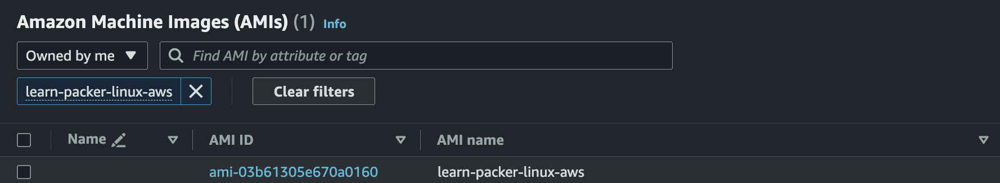

# Quick_Start_AWS01
Ref : https://developer.hashicorp.com/packer/tutorials/aws-get-started

## A. Install Packer
- Packer Download  
    <br>
    Ref : https://developer.hashicorp.com/packer/downloads

- MAC Example
    ```bash
    $ wget https://releases.hashicorp.com/packer/1.9.4/packer_1.9.4_darwin_arm64.zip
    $ unzip packer_1.9.4_darwin_arm64.zip 
    $ mv ./packer /usr/local/bin/packer 
    ```

- Verify Packer Installation
    ```bash
    $ packer --version
    1.9.4
    ```
    Ref : https://developer.hashicorp.com/packer/tutorials/aws-get-started/get-started-install-cli


## B. Build an Image
- File Structure
  ```bash
  $ mkdir packer_tutorial
  $ touch packer_tutorial/aws-ubuntu.pkr.hcl
  $ cd packer_tutorial
  tree
    .
    └── packer_tutorial
        ├── README.md
        └── aws-ubuntu.pkr.hcl
  ```
- aws-ubuntu.pkr.hcl
    ```hcl
    packer {
        required_plugins {
            amazon = {
                version = ">= 1.2.6"
                source  = "github.com/hashicorp/amazon"
            }
        }
    }

    source "amazon-ebs" "ubuntu" {
        ami_name      = "learn-packer-linux-aws"
        instance_type = "t2.micro"
        region        = "ap-northeast-2"
        source_ami_filter {
            filters = {
                name                = "ubuntu/images/*ubuntu-xenial-16.04-amd64-server-*"
                root-device-type    = "ebs"
                virtualization-type = "hvm"
            }
            most_recent = true
            owners      = ["099720109477"]
        }
        ssh_username = "ubuntu"
    }

    build {
        name    = "learn-packer"
        sources = [
            "source.amazon-ebs.ubuntu"
        ]
    } 
    ```


### Create Image
***1. Initialize Packer configuration***
```bash
$ packer init .  
Installed plugin github.com/hashicorp/amazon v1.2.7 in "/Users/{User}/.config/packer/plugins/github.com/hashicorp/amazon/packer-plugin-amazon_v1.2.7_x5.0_darwin_arm64"
```

***2. Format and validate your Packer template***
```bash
$ packer validate .
aws-ubuntu.pkr.hcl 

$ packer build aws-ubuntu.pkr.hcl
The configuration is valid.
```

***3. Build Packer image***
```bash
$ packer build aws-ubuntu.pkr.hcl
learn-packer.amazon-ebs.ubuntu: output will be in this color.

==> learn-packer.amazon-ebs.ubuntu: Prevalidating any provided VPC information
==> learn-packer.amazon-ebs.ubuntu: Prevalidating AMI Name: learn-packer-linux-aws
    learn-packer.amazon-ebs.ubuntu: Found Image ID: ami-0dd97ebb907cf9366
...
==> learn-packer.amazon-ebs.ubuntu: Creating AMI learn-packer-linux-aws from instance i-0c0ea1908ca06236f
    learn-packer.amazon-ebs.ubuntu: AMI: ami-03b61305e670a0160
...
Build 'learn-packer.amazon-ebs.ubuntu' finished after 3 minutes 15 seconds.

==> Wait completed after 3 minutes 15 seconds

==> Builds finished. The artifacts of successful builds are:
--> learn-packer.amazon-ebs.ubuntu: AMIs were created:
ap-northeast-2: ami-03b61305e670a0160
```
<br>